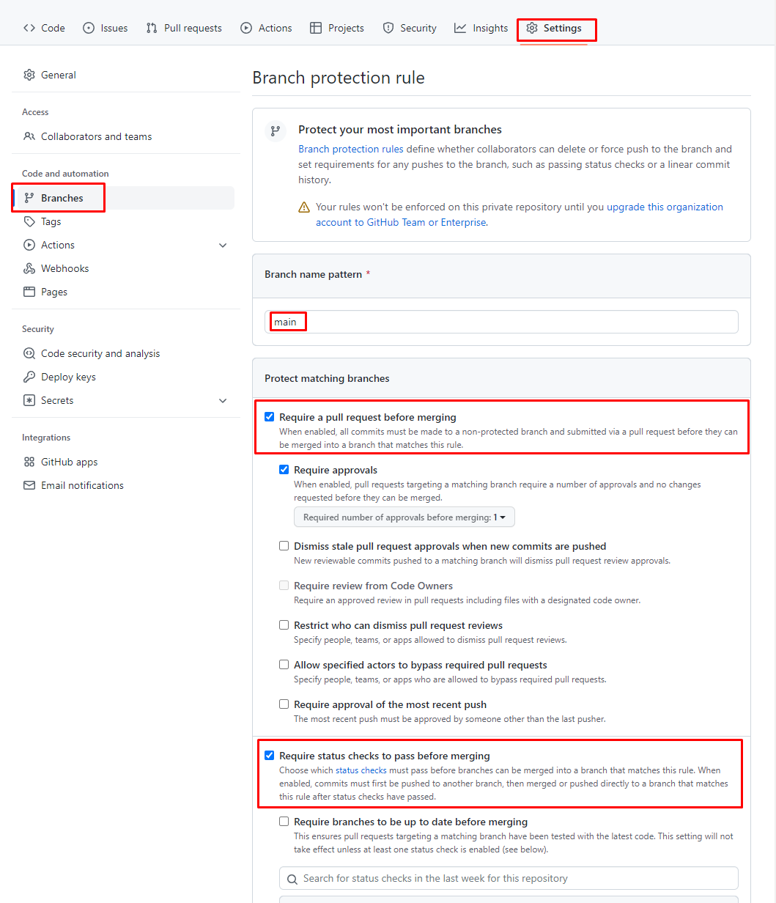
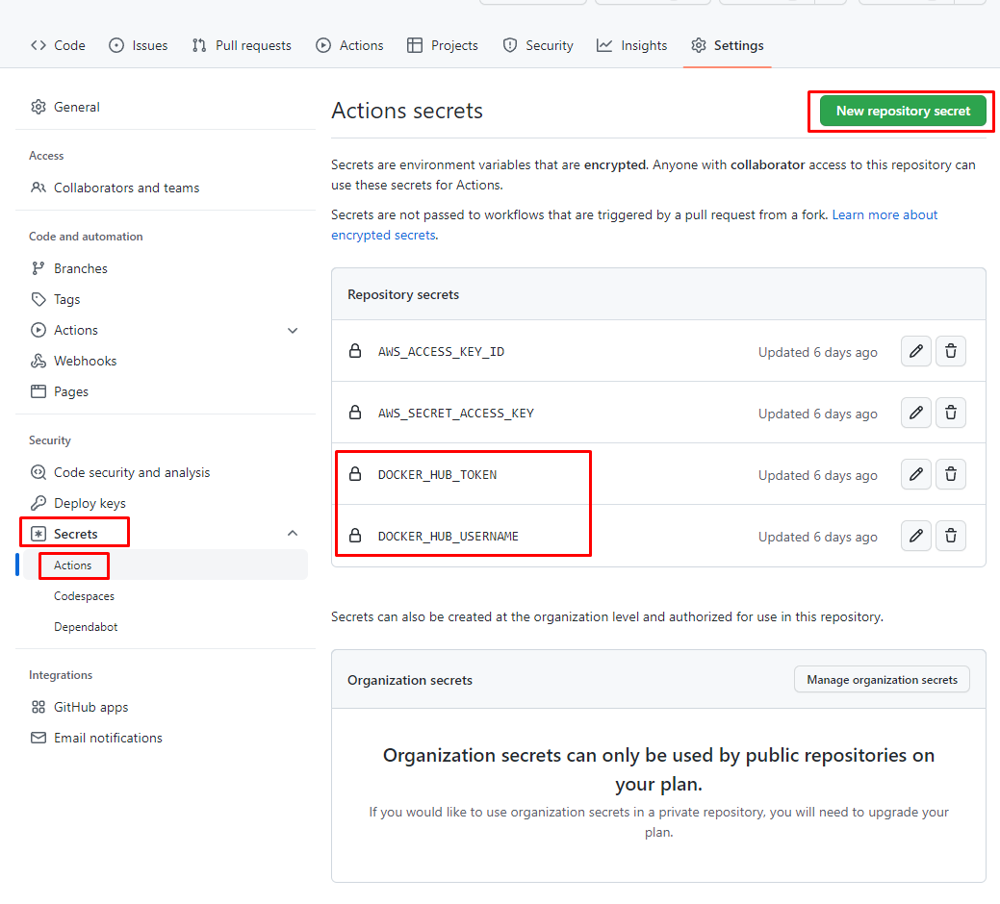
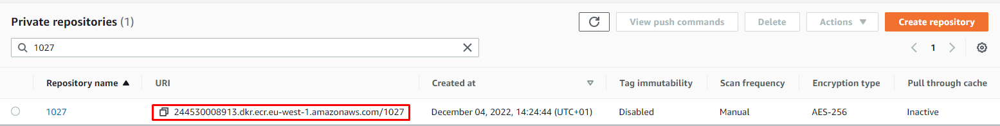
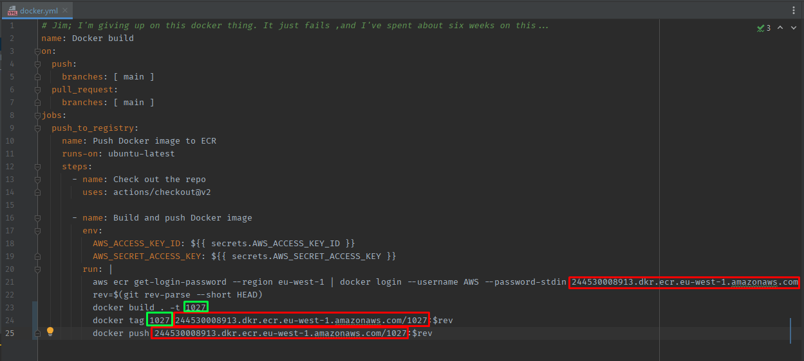
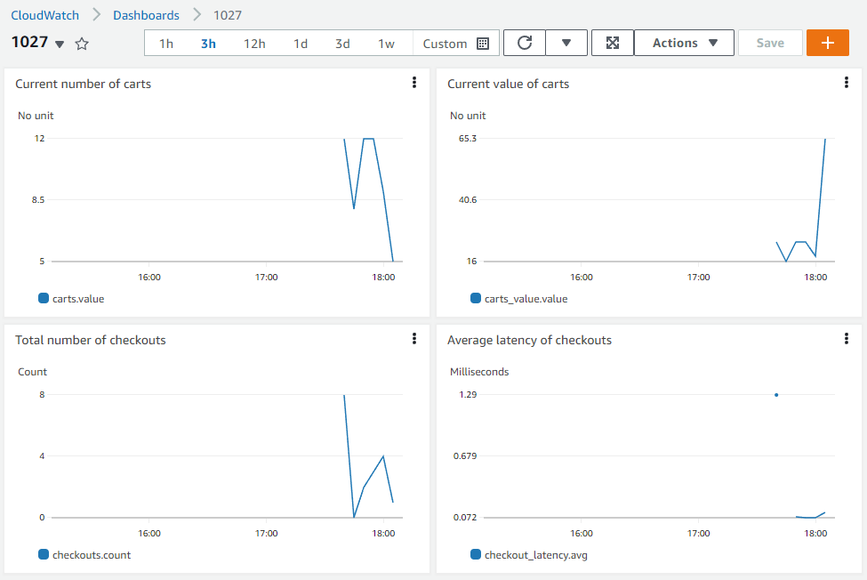
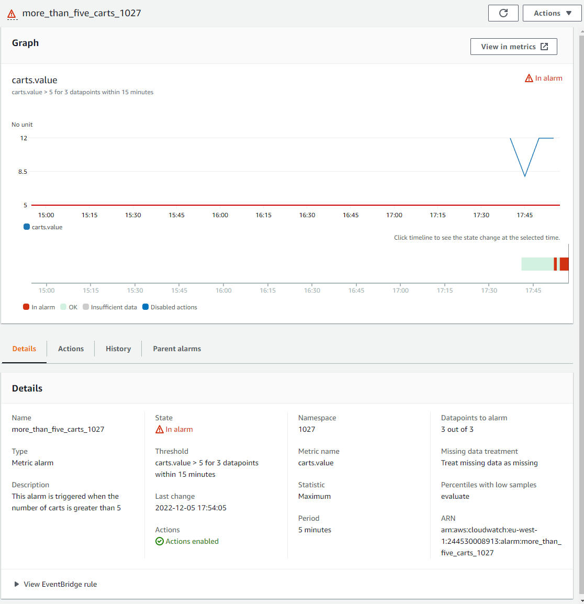

---
# DevOps med gode intensjoner

---

# Besvarelse

## Del 1 - Drøftingsoppgaver

_Ser at jeg svarte på store deler av oppgave 2, 3, og 4 som en del av oppgave 1. Jeg har derfor bare oppsummert de mest relevante tingene per oppgave på de andre punktene_


### Ordbok

| **ORD**                    | **BESKRIVELSE**                                                                                                                                                                                                                                                                                                                                                   |
|----------------------------|-------------------------------------------------------------------------------------------------------------------------------------------------------------------------------------------------------------------------------------------------------------------------------------------------------------------------------------------------------------------|
| **DevOps**                 | DevOps er en kultur som kombinerer utvikling og drift, og som har som mål å optimalisere hastigheten av leveranse av verdi til kunden                                                                                                                                                                                                                             |
| **Flow**                   | Flow - eller flyt - handler om arbeidsflyten. Målet er at man kutter ned på waste, og benytter verktøy for å forbedre prosessen                                                                                                                                                                                                                                   |        
| **Waste**                  | Waste er unødvendige arbeidsoppgaver eller bruk av tid som kan og bør elimineres fra en prosess                                                                                                                                                                                                                                                                   |          
| **Lean**                   | Lean er når man har fjernet så mye waste som mulig, og jobber optimalt.                                                                                                                                                                                                                                                                                           |
| **CI**                     | Continuous Integration - Kombinasjonen av prinsipper, verktøy, og arbeidsmetoder for å optimalisere hastigheten av intern leveranse                                                                                                                                                                                                                               |
| **CD**                     | Continuous Delivery - Kombinasjonen av prinsipper, verktøy, og arbeidsmetoder for å optimalisere hastigheten av ekstern leveranse                                                                                                                                                                                                                                 |
| **Infrastructure as code** | Infrastructure as code - Konsept for å skrive kode for å opprette infrastruktur.                                                                                                                                                                                                                                                                                  |                                                                   |                                                                                                                                                |
| **Docker**                 | Docker er et verktøy som lar deg pakke inn applikasjoner i en container, som igjen kan kjøres eller deles med andre                                                                                                                                                                                                                                               |
| **Docker Container**       | Docker Container er en instans som kjører programmet eller verktøyet den blir instruert til å kjøre. Dette kan f.eks være en tjeneste eller en database.                                                                                                                                                                                                          |
| **Docker Image**           | Docker Image er en fil som inneholder instruksjoner for å sette opp Docker Containers, og hvordan de henger sammen.                                                                                                                                                                                                                                               |
| **Terraform**              | Terraform er et "infrastruktur som kode"-verktøy som lar deg definere et oppsett av infrastruktur, og deretter opprette det.                                                                                                                                                                                                                                      |
| **Git**                    | Git er et verktøy for å holde styr på endringer i kildekode, og som lar deg dele endringer med andre                                                                                                                                                                                                                                                              |
| **GitHub**                 | GitHub er en tjeneste som lar deg lagre kildekode i Git, og dele den med andre.                                                                                                                                                                                                                                                                                   |
| **GitHub Actions**         | GitHub Actions er en tjeneste i GitHub som lar deg kjøre automatiserte oppgaver, som f.eks bygging av infrastruktur, kjøring av tester, eller deployment                                                                                                                                                                                                          |
| **AWS**                    | AWS er en skyplattform fra Amazon, som tilbyr et stort utvalg av tjenester som gjør det enkelt å lagre, dele, og kjøre kode i skyen.                                                                                                                                                                                                                              |
| **Feature Toggles**        | Feature Toggles er en funksjon som lar deg slå av og på funksjonalitet i en live applikasjon.                                                                                                                                                                                                                                                                     |
| **Blue/Green Deployment**  | Blue/Green Deployment er en metode for å gradvis bytte ut en applikasjon med en ny versjon, uten at det påvirker brukerne. Man lar en gruppe benytte den nye versjonen, og resten benytter den gamle - Hvis det ikke er noen problemer kan man fase ut den gamle helt, og hvis det er noen problemer kan alle brukerne gå over på den gamle til den nye er fikset |


### 1️⃣ Utfordringer med dagens systemutviklingsprosess
_Hva er utfordringene med dagens systemutviklingsprosess - og hvordan vil innføring av DevOps kunne være med på å løse disse? Hvilke DevOps prinsipper blir brutt?_
Shopifly har en systemutviklingsprosess som ikke implementerer så mange DevOps-prinsipper. De har startet å implementere noen elementer ved å benytte Terraform og Docker, men bare fordi de har begynt å implementere noen verktøy betyr ikke det at de kjører “DevOps”.

En av hovedpunktene i DevOps er at man samler utvikling og ops-avdelingen, til en DevOps-avdeling, der utviklerne holder i hele prosessen fra start til slutt - og opprettholdelse. Mye av denne prosessen kan - og bør - selvfølgelig automatiseres for å gjøre jobben bedre og enklere for alle.

Det første punktet nevner at de kun deployer kode en gang i kvartalet - på en mandag. Ved å ha en fast dag med leveranse, og lang tid mellom hver gang, så kan man havne i situasjoner der essensiell funksjonalitet ikke får blitt med i leveransen på tre måneder, eller at dårlig kode blir liggende over lang tid. Det er også fare for å skape “crunch”-kultur, der man sitter mange, og lange, dager opp mot release for å rekke å gjøre ferdig alt. Det kan hende at andre team er avhengige av funksjonalitet for å kunne fortsette på sine arbeidsoppgaver, og det kan fort genereres waste av at man må vente i flere måneder på å kunne gå videre med noe.

I punkt to nevnes det at man har ansatt et Test-team, og at ledelsen på utviklerteamet må godkjenne alle leveranser. Ved å ha et eget team som skal passe på at funksjonaliteten fungerer som den skal, mister utviklerteamet eierskap til eget produkt. Flowen i prosjektet blir oppstykket, og det kan ta lengre tid å få feedback. Manuell testing av løsninger er testløsningen som tar lengst tid av all form for testing, og generer da også mye waste i en løsning.

Punkt tre nevner at de ruller tilbake hele løsningen hvis noe feiler. Med bakgrunn i at de kun deployer hver tredje måned, vil det være veldig mye funksjonalitet som blir fjernet ved en tilbakerulling av prosjektet. Det vil også være vanskelig å finne ut hvor feilen ligger, da det er mer kode å gå gjennom - og siden man benytter manuell testing må man også manuelt finne feilen.

Det siste punktet tar opp problemet med at leveransen ikke er en del av utviklingspipelinen og gjøres manuelt av utviklerteamet. Her ser vi også at det er en egen ops-avdeling som tar seg av oppsett og opplastning av prosjektet manuelt.

I Shopifly vil det være mange muligheter til å optimalisere systemutviklingsprosessen. De er en bedrift som har mye potensiale for å dra nytte av DevOps, og det skal ikke så mye til for å få dem i gang.

I første runde bør de ta en titt på CI (Continuous Integration. Ved å automatisere mye av interne leveranser, kan man effektivisere arbeidsmåten, og leveranser vil gå fortere og gjerne være av høyere kvalitet. Man kan f.eks gå over til å lene seg mye på Github Actions. Ved å skrive gode integrasjonstester og unit-tester, kan man redusere mengden manuell testing og godkjenning av leveranser - som da gjør prosessen mer lean ved å redusere waste.

Ved å benytte flere verktøy for å automatisere flowen, kan man ha færre overleveringer, da alle har tilgang på det siste automatisk. Ved å benytte Docker, Terraform, og en skyleverandør som AWS, kan man automatisere oppsett og drift av miljø, slik at alle jobber mot samme versjon og innhold av forskjellige programmer.

En annen viktig ting vil være å gi utviklerne eierskap til hele pipelinen, ved å legge test- og ops-arbeidet over til dem. Testarbeidet vil være å lage gode tester for tjenesten - og når arbeidet først er gjort, og testene først er utviklet vil de passe på at koden alltid kjører som forventet. Det vil sannsynligvis være behov for en QA-avdeling, men arbeidet deres vil ikke lenger være å teste generisk funksjonalitet. Mye av arbeidet til Ops-avdelingen kan også automatiseres ved å ha egne pipelines som håndterer bygging og pushing til prod, slik at man ikke trenger manuell filhåndtering og overlevering.

Når det kommer til tilbakerulling vil mye av arbeidet allerede være løst ved å ha hyppige leveranser og høy testdekning, men det er også mulig å legge til feature toggles - som gjør at man enkelt kan skru av og på funksjonalitet, slik at man slipper tilbakerulling hvis noe går galt. Det finnes også programmer som lar deg gradevis gå over til en ny versjon, ved å ha to (eller flere) løsninger kjørende samtidig, der en viss andel får tilgang til den gamle, og noen får tilgang til den nye. Når man ser at alt går fint, kan man fase ut den gamle helt - hvis ikke, kan man slå av den nye, fikse feilene, og prøve igjen - uten noe nedetid.

Ved å ha en DevOps-avdeling kan man aktivt monitorere og fikse problemer før - under - og etter feilen har skjedd. Man kan sette opp alarmer som gjør at man blir obs på problemer øyeblikket det bryter ut, og man har selv mulighet til å gjøre noe med problemet.


### 2️⃣ Problemet med ferre utgivelser og mer kontroll
_En vanlig respons på mange feil under release av ny funksjonalitet er å gjøre det mindre hyppig, og samtidig forsøke å legge på mer kontroll og QA. Hva er problemet med dette ut ifra et DevOps perspektiv, og hva kan være en bedre tilnærming?_

Poenget med DevOps er at man skal ha mye automasjon, eierskap til hele prosessen, og hyppig utvikling og deployment. Ved å bygge et rammeverk som baserer seg på DevOps-prinsipper, kan feil som oppstår bli håndtert raskt og effektivt - da hurtig implementering også betyr hurtig bug-fixing. En bedre tilnærming er å bygge en flow som gjør det enkelt å implementere ny funksjonalitet - og enkelt å fikse funksjonaliteten hvis problemer oppstår.

Det er flere måter å implementere dette på - bl.a feature toggles som lar deg skru av og på funksjonalitet i en live kodebase, blue/green deployment for å passe på at den nye versjonen fungerer, og alarmer som sier ifra når noe går ned. Ved å lage et rammeverk som tar utgangspunkt i hvordan man håndterer feil - i steden for å lage rammeverk som baserer seg på at feil ikke skal skje - så reduserer man tidsbruk og waste før, under, og etter utvikling. Man får også en kultur der det er lov til å prøve og feile, og når feil først skjer så vet man hvordan man skal håndtere det på en effektiv måte.

### 3️⃣ Problemet med overlevering av kode
_Teamet overleverer kode til en annen avdeling som har ansvar for drift - hva er utfordringen med dette ut ifra et DevOps perspektiv, og hvilke gevinster kan man få ved at team han ansvar for både drift- og utvikling?_

Poenget med DevOps er at Dev også skal drive med Ops - altså drifte koden man selv har skrevet. Fordelene med dette er at utviklerne står ansvarlig for koden de leverer, og hvis det oppstår problemer må de selv fikse det. Personen som skriver koden er sannsynligvis personen som kjenner koden best - og vil da kunne løse problemet raskere enn en annen person som har fått overlevert koden fra en annen. Målet med DevOps er også færrest mulige overleveringer, da hvert ledd involvert vil generere noe waste i overlevering av kode.

Når feil først oppstår vil en utvikler ha muligheten til å fikse og forbedre koden, slik at det ikke oppstår igjen. Utvikleren har heller ingen mulighet til å skylde på seg selv hvis koden går ned, og man får et insentiv til å skrive god kode, slik at man ikke blir vekket av en alarm midt på natta.

### 4️⃣ Hvordan DevOps-prinsipper kan redusere risiko ved release
_Å release kode ofte kan også by på utfordringer. Beskriv hvilke- og hvordan vi kan bruke DevOps prinsipper til å redusere eller fjerne risiko ved hyppige leveraner._

Hyppig release av kode kan føre til alle de samme problemene som all release av kode har - og sannsynligvis vil det skje oftere. Dette kan også føre til at ny funksjonalitet muligens blir bygget på koden som inneholder feilene. Til gjengjeld kan hyppige releases gjøre at man oppdager problemene tidlig, og forhåpentligvis har mulighet til å gjøre endringer før koden er innviklet gjennom hele systemet.

## Del 2 - CI

### Oppgave 1
- [x] Workflow kjører når man lager en pull-request, og på push til main

### Oppgave 2
- [x] ci.yml feiler når testene feiler
- [x] testen kjører grønt
- [x] workflowen kjøres på hver push uavhengig av branch

### Oppgave 3

#### Hvordan konfigurere fork for branch-protection & status-sjekk
- [ ] Gå inn på "settings"
- [ ] Gå til "branches"
- [ ] Velg "add branch protection rule"
- [ ] På "Branch name pattern" skriver du inn "main" (navnet på branchen reglene gjelder for)
- [ ] Huk av for "Require pull request reviews before merging"
- [ ] Huk av for "Require status checks to pass before merging"


## Del 3 - Docker

### Oppgave 1
For å få en workflow til å fungere med Dockerhub må man

- [x] Gå inn på "settings"
- [x] Gå inn på "secrets"
- [x] Gå inn på "actions"
- [x] Trykk på "new repository secret", legg inn name = DOCKER_HUB_USERNAME, secret = \<ditt brukernavn på Dockerhub>
- [x] Trykk på "new repository secret", legg inn name = DOCKER_HUB_TOKEN, secret = \<ditt passord på Dockerhub>


### Oppgave 2
- [x] Lag en container for maven
- [x] Bygg shopify basert på maven-containeren
- [x] Fjernet maven fra docker.yml workflowen

### Oppgave 3
- [x] Endre docker.yml til å benytte ECR

#### Hvordan konfigurere fork for ECR
- [ ] Gå inn på AWS-miljøet (det som er benyttet for oppgaven er https://244530008913.signin.aws.amazon.com/console)
- [ ] Gå inn på "ECR"
- [ ] Trykk på "Create repository"
- [ ] Når ECR er opprettet, bytt ut path i docker.yml med repository-urlen til ECR - denne står under "View push commands" i ECR, eller i URI-feltet i ECR



- [ ] Endre tag-navnet til noe passende.
- [ ] Gå inn på "IAM"
- [ ] Gå inn på "Users"
- [ ] Velg din bruker
- [ ] Velg "Security credentials"
- [ ] Trykk på "Create access key"
- [ ] På Github, legg til nye secrets på samme måte som i oppgave 1, basert på access key og secret access key fra AWS IAM
- [ ] Trykk på "new repository secret", legg inn name = AWS_ACCESS_KEY_ID, secret = \<Access key ID>
- [ ] Trykk på "new repository secret", legg inn name = AWS_SECRET_ACCESS_KEY, secret = \<Secret access key>

Inne på ECR-repoet er det også en knapp "View push commands", med kommandoer som kan brukes for å pushe til ECR.

## Del 4 - Metrics

### Oppgave 1
- [x] Legg til Metrics i pom.xml
- [x] Legg config for Metrics i MetricsConfig

### Oppgave 2
- [x] Legg til Metrics i ShoppingCartController
- [x] Lag Metrics for carts (antall på et gitt tidspunkt)
- [x] Lag Metrics for totalsummen av items i alle carts (sum på et gitt tidspunkt)
- [x] Lag Metrics for antall checkouts (totalt antall checkouts)
- [x] Lag Metrics for latency på checkouts

## Del 5 - Terraform & CloudWatch Dashboards

### Oppgave 1

#### Hvorfor prøver Terraform å opprette ny bucket?

Terraform lagrer en "state" som informerer om hvilke ressurser som eksisterer. Hvis en ressurs ikke eksisterer, må den lages. 
For at terraform skal finne analyse-bucketen, må man lage en "backend" som lagrer state-filen i en eksisterende bucket, slik at terraform vet at ressursen finnes.
Ved å legge til en **backend** i provider.tf, vil terraform vite at det allerede eksisterer en analyse-s3-ressurs, og benytte denne i steden for å opprette ny.
Jeg har gjort dette ved å opprette en egen s3-bucket som heter "1027-terraform-state", som lagrer state-filen til terraform.

### Oppgave 2
- [x] Kun kjør Terraform apply på push til main

### Oppgave 3
- [x] Opprett CloudWatch dashboard med metrics fra oppgave 2
  - [x] Carts
  - [x] Total sum
  - [x] Checkouts
  - [x] Latency
- [x] Legg til alarm hvis antall handlekurver er over 5 over tre perioder på 5 minutter



---

# OPPGAVE

## Krav til leveransen

* Eksamensoppgaven er gitt på GitHub repository ; https://github.com/PGR301-2022/eksamen_2022
* Du skal ikke lage en fork av dette repositoryet, men kopiere innholdet til et nytt. Årsaken er at sensor vil lage en fork av ditt repo, og arbeidsflyten blir lettere hvis ditt repo ikke er en fork. 
* Du kan jobbe i et public-, eller privat repo, og deretter gjøre det public noen timer etter innleveringsfrist hvis du er bekymret for plagiat fra medstudenter.

Når sensor evaluerer oppgaven vil han/hun se på

* Ditt repository og "Actions" fanen i GutHub for å bekrefte at Workflows faktisk virker
* AWS miljøet i klassens AWS konto for å bekrefte at oppgaver som beskrevet er utført
* Vurdere drøftelsesoppgavene. Du må lage en  "Readme" for besvarelsen i ditt repo.
* Sensor vil Lage en fork av ditt repo og tester ut pipelines med egen AWS bruker/github bruker.

Ved innlevering via WiseFlow, lager du et *tekstdokument* som kun inneholder link til dit repository

## Litt om GitHub free tier

* I oppgaven blir du bedt om å lage GitHub actions workflows.
* Med GitHub "Free tier" har du 2,000 minutter med gratis byggetid per måned, dersom du bruker et privat repo.
* Dersom dere i en ekstrem situasjon skulle trenge mer byggetid, kan dere gjøre repository public. Da er byggetiden ubegrenset.
* Hvis dere da er bekymret for at andre skal kopiere arbeidet deres, kan dere lage en ny GitHub bruker med et tilfeldig navn.

OBS!

* I "Free" planen til GitHub er "branch protection" ikke tillat når et repository er privat. Det vil si at dere ikke kan konfigurere GitHub til å hindre push mot for eksempel _main_ branch direkte, eller konfigurere regler for godkjenning før merge av pull request osv.
* I denne oppgaven blir dere bedt om å beskrive _hvordan_ dette kan gjøres, men dere trenger altså ikke konfigurere dette for repoet dere leverer.

## Evaluering

* Del 1 DevOps-prinsipper - 20 poeng
* Del 2 CI - 20 poeng
* Del 3 Docker - 20 poeng
* Del 4 Del - Metrics med Micrometer 20 poeng
* Del 5 Del - Terraform og CloudWatch Dashboards - 20 poeng

## Utvikling i Cloud 9

Dere kan bruke et utviklingsmiljø i Cloud 9. https://244530008913.signin.aws.amazon.com/console - logg på med studentnavn.
Cloud9 miljøene er ble laget på nytt i løpet av helgen før eksamen starter, passord er det "vanlige"

* Siden Cloud 9 miljøet blir laget på nytt før eksamen; må du installere Maven, sette opp "credential helper" osv. Se på en av øvingene vi har gjort i semesteret. 

Hvis dere får følgende feilmelding når dere bygger koden med maven i Cloud9, må dere bare gjøre en "mvn clean"

```text
java.lang.Error: 
Unresolved compilation problem: 
        The method builder() is undefined for the type Cart
        at no.shoppifly.CartServiceTest.shouldRemoveCartAfterCheckout(CartServiceTest.java:13)
```

### Bonusoppgave - 5 Poeng

Vi fant aldi ut av hvorfor ovnernevnte problem oppstår av og til med Maven i Cloud9. Hvis du klarer å reprodusere feilen konsekvent
og kan komme med en forklaring på hvorfor dette skjer, og hva vi kan gjøre for å fikse det, gis 5 ekstra poeng. 

## Scenario

Som DevOps-ekspert, ferdig utlært fra Høgskolen Kristiania blir du ansatt i en bedrift, "Shopifly" som selger droner, 
men også andre varer nå som det nærmer seg jul. 

Shopifly har store utfordringer med utviklingsprosessen sin

* De deployer kode første mandag i kvartalet.
* De pleide å deploye oftere før- men dette førte til ustabilitet. Selskapet ansatte flere testere, og startet en prosess der utviklingsledere måtte se over og godkjenne alle leveranser. De senket samtidig frekvensen på leveransene sine for å få bedre stabilitet.  
* Når de deployer, feiler det fortsatt ofte. Da ruller de tilbake til forrige versjon, og ny funksjonalitet blir derfor ofte forsinket i månedsvis

* Leveransen skjer ved at Utviklingsteamet bruker FTP til å overføre en Spring boot JAR sammen med dokumentasjon i en
  ZIP. En egen avdeling tar i mot disse filene og installerer i AWS / Produksjon.

For å løse problemene sine, leide selskapet så inn DevOps-kompetanse fra Gaffel Consulting. Etter å ha sendt fire
juniorkonsulenter som fakturerte for en liten formue ble det klart at de aldri kom til å klare å levere, og kontrakten ble sagt opp.
"Jim" den "mest senior" av juniorkonsulentene har lagt inn noen kommentarer i koden som kan være til hjelp. 

Det Gaffel Consulting klarte å levere på den medgåtte tiden ligger i dette repositoryet. 

Nå er det din tur til å ta over!

## Beskrivelse av API

Selskapet driver med elektronisk handel, og fokus for denne oppgaven er et API som 
implementerer en handlekurv. Gjør deg godt kjent med APIet og hvordan det virker - via Postman / Curl før du starter på oppgaven.

Du kan starte applikasjonen, enten i ditt Cloud9 miljø- eller på lokal maskin med kommandoen 

```sh
mvn spring-boot:run
```

### Request headers

OBS! For alle reqestene trenger å du sette HTTP header 'Content-Type: application/json'

### Opprette handlekurv - POST /cart

Du kan lage ny handlekurv ved å gjøre en HTTP POST til ````/cart````
Uten "id"

*Request body*

```json
{
  "items": [
    {
      "description": "Ugly christmas sweater",
      "qty": "1",
      "unitPrice": "500"
    }
  ]
}
```

*Respons*

*id* blir satt automatisk

```json
{
  "id": "fb49e386-7124-4c16-9067-2dde2ee75d4e",
  "items": [
    {
      "description": "Ugly christmas sweater",
      "qty": 1,
      "unitPrice": 500.0
    }
  ]
}

```

*Curl-eksempel*

```sh 
curl --location --request POST 'http://localhost:8080/cart' \
  --header 'Content-Type: application/json' \
  --data-raw '{
      "items": 
      [
        {
          "description": "Ugly christmas sweater",
          "qty": "1",
          "unitPrice": "500"
        }
      ]
  }'
```

### Oppdatere handlekurv - POST /cart

Du kan poste et helt cart-objekt med en "id" for å oppdatere handlekurven

*Request*

````json 
{
    "id": "fb49e386-7124-4c16-9067-2dde2ee75d4e",
    "items": [
        {
            "description": "Ugly christmas sweater",
            "qty": 1,
            "unitPrice": 500.0
        },
        {
            "description": "Shark socks",
            "qty": 20,
            "unitPrice": 10.0
        }
    ]
}
````

*Response*

Samme som request

#### Eksempel Curl kommando

```sh
curl --location --request POST 'http://localhost:8080/cart' \
--header 'Content-Type: application/json' \
--data-raw '{
    "id": "fb49e386-7124-4c16-9067-2dde2ee75d4e",
    "items": [
        {
            "description": "Ugly christmas sweater",
            "qty": 1,
            "unitPrice": 500.0
        },
        {
            "description": "Shark socks",
            "qty": 20,
            "unitPrice": 10.0
        }
    ]
}'
```

### Fullføre handel - POST /cart/checkout

Sjekker ut handlekurven, sletter den fra listen over aktive handlekurver og returnerer en ordre ID

#### request

````json 
{
    "id": "fb49e386-7124-4c16-9067-2dde2ee75d4e",
    "items": [
        {
            "description": "Cheap 4K Drone with spare parts (needed)",
            "qty": 1,
            "unitPrice": 500.0
        },
        {
            "description": "Shark socks",
            "qty": 20,
            "unitPrice": 10.0
        }
    ]
}
````

#### Response

```text
25d07757-4e56-408c-be30-a0568d35a70d
```

* Eksempel Curl kommando*

```sh
curl --location --request POST 'http://localhost:8080/cart/checkout' \
--header 'Content-Type: application/json' \
--data-raw '{
    "id": "fb49e386-7124-4c16-9067-2dde2ee75d4e",
    "items": [
        {
            "description": "Ugly christmas sweater with Drone logo",
            "qty": 1,
            "unitPrice": 500.0
        },
        {
            "description": "Shark socks",
            "qty": 20,
            "unitPrice": 10.0
        }
    ]
}'
```

### Hente alle handlekurver - GET /carts

Du kan få en oversikt over alle aktive handlekurver med dette endepunktet. 

*Response*

```json
[
"4eb4d739-5df9-48b1-84c0-57c039d4fe35",
"cc7068e8-b855-416f-a34c-65dcdf478174",
"9e1e846f-45b7-472d-8bde-af9eba3224a5"
]
```

*Eksempel Curl kommando*

```sh 
curl --location --request GET 'http://localhost:8080/carts' \
--header 'Content-Type: application/json'
```

## Del 1 DevOps-prinsipper

Beskriv med egne ord;

* Hva er utfordringene med dagens systemutviklingsprosess - og hvordan vil innføring av DevOps kunne være med på å løse
  disse? Hvilke DevOps prinsipper blir brutt?
* En vanlig respons på mange feil under release av ny funksjonalitet er å gjøre det mindre hyppig, og samtidig forsøke å legge på mer kontroll og QA. Hva er problemet med dette ut ifra et DevOps perspektiv, og hva kan være en bedre tilnærming?
* Teamet overleverer kode til en annen avdelng som har ansvar for drift - hva er utfordringen med dette ut ifra et DevOps perspektiv, og hvilke gevinster kan man få ved at team han ansvar for både drift- og utvikling? 
* Å release kode ofte kan også by på utfordringer. Beskriv hvilke- og hvordan vi kan bruke DevOps prinsipper til å redusere
  eller fjerne risiko ved hyppige leveraner.

## Del 2 - CI

Konsulentene som har jobbet med innføring av DevOps har startet på en GitHub actions workflow for kontinuerlig
integrasjon. GitHub actions workflow (yml) filen ligger i dette repositoryet og heter ````ci.yml````

Problemet er at utviklingsteamet må starte jobben manuelt fra GitHub actions brukergrensesnittet. Det er jo ikke bra!

Du kan gjerne teste dette selv ved å gå til "Actions" i ditt repository, du vil se teksten "This workflow has a workflow_dispatch event trigger." Og vil
ha et valg som heter "Run workflow"

### Oppgave 1 

* Start med å få workflowen til å kjøre når det lages en pull request, og på hver push til main branch

### Oppgave 2 

Det er andre utfordringer med denne flyten også; Workflowen kjører "ok" selv om det åpenbart er unit-testfeil i koden. 

* Få først ```ci.yml```workflow til å feile fordi enhetstesten feiler. 
* Rett deretter enhetstesten og se at pipeline kjører "ok".  
* Workflowen skal kompilere javakoden og kjøre enhetstester på hver eneste push, *uavhengig av branch* 

### Oppgave 3 

Branch protection og status sjekker - Beskriv hva sensor må gjøre for å konfigurere sin fork på en slik måte
at

* Ingen kan pushe kode direkte på main branch
* Kode kan merges til main branch ved å lage en Pull request med minst en godkjenning
* Kode kan merges til main bare når feature branchen som pull requesten er basert på, er verifisert av GitHub Actions.

## Del 3 - Docker

Applikasjonen er laget for å pushe et container image til Docker Hub. 

Det ligger en ```Dockerfile``` i prosjektet, og en workflow fil som heter ```docker.yml``` .

### Oppgave 1

Beskriv hva du må gjøre for å få workflow til å fungere med din DockerHub konto? Hvorfor feiler workflowen? 

### Oppgave 2

Når du har fikset problemet i oppgave 1, og du forøker å kjøre applikasjonen fra Docker hub med for eksempel; 
```docker run <dockerhub brukeravn>/shopifly```

Får du en feilmelding 
```text
Exception in thread "main" java.lang.UnsupportedClassVersionError: no/shoppifly/CddemoApplication has been compiled by a more recent version of the Java Runtime (class file version 55.0), this version of the Java Runtime only recognizes class file versions up to 52.0
        at java.lang.ClassLoader.defineClass1(Native Method)
        at java.lang.ClassLoader.defineClass(ClassLoader.java:756)
        at java.security.SecureClassLoader.defineClass(SecureClassLoader.java:142)
        at java.net.URLClassLoader.defineClass(URLClassLoader.java:473)
        at java.net.URLClassLoader.access$100(URLClassLoader.java:74)
        at java.net.URLClassLoader$1.run(URLClassLoader.java:369)
        at java.net.URLClassLoader$1.run(URLClassLoader.java:363)
```

De annsatte i Gaffel consulting tenkte at Maven-bygget kunne kjøres i GitHub Actions, med  ```mvn ...```, og at JAR filen kunne kopieres inn i Container Image docker under bygging.  

Men så bestemte en av utviklerene seg for å oppgradere Javaversjonen i pom.xml, og workflow filen, til Java 11. 
Alt stoppet å fungere! Som dere ser av Dockerfilen, kjører Spring boot på Java 8...

```
FROM adoptopenjdk/openjdk8
```

Konsulentene ga opp, og hoppet som vanlig over på en annen oppgave. Så for øyeblikket har ikke Shopifly en fungerende applikasjon. 

Vi kan få bedre kontroll på byggeprosessen ved også å gjøre maven bygget i en container. For å unngå lignende problemer i fremtiden ønsker vi derfor å bruke Docker til kompilere- og bygge koden.

* Skriv om Dockerfilen. til bruke en *Multi Stage Build*. 
* Du må også rydde opp i ```docker.yml``` workflow filen... Fjern ønødvendige "steps".

### Oppave 3

Gaffel consulting var ikke klar over at det var en dårlig idè å ha sitt container image i et offentlig Docker hub repository - og Shopifly har allerede sett at flere hundre har lastet ned deres container image.
Et privat ECR repository i AWS er en bedre løsning.

* Lag dit eget ECR repository med kandidatnummer som navn, enten ved hjelp av UI - eller ved hjelp av CLI.
* Endre ```docker.yml```, workflow til å pushe docker container til Amazon ECR, istedet for docker hub
* Beskriv deretter med egne ord hva sensor må gjøre for å få sin fork til å laste opp container image til sitt eget ECR repo.
* Docker workflow skal pushe et container image med en tag som er lik GitHub commit hash (id); for eksempel ```244530008913.dkr.ecr.eu-west-1.amazonaws.com/glenn_exam_practice:8234efc```

## Del 4 - Metrics, overvåkning og alarmer

Cloud9 er ikke verdens beste IDE. Det anbefales å gjøre den følgende oppgaven på lokal PC. Husk å kjøre  
```aws configure``` 
;-) 

### Oppgave 1

Gjør nødvendige endringer i ```pom.xml``` - og koden, slik at applikasjonen kan levere Metrics til CloudWatch ved hjelp av Spring Boot Micrometer.
Konfigurer applikasjonen til å bruke ditt eget ClodWatch Metrics Namespace - ditt Kandidatnummer. 

*OBS!* Når dere innfører Micrometer i koden deres, vil enhetstesten slutte å fungere. Dere får lov til å slette 
enhetstesten når dere starter å jobbe med denne oppgaven. I "virkeligheten" ville vi brukt et rammeverk som feks Mockito  
til å "mocke" micrometer fra enhetstestene, men det er ikke ønskelig at dere skal bruke tid på dette under eksamen!

### Oppgave 2 

Endre Javakoden slik at den rapporterer følgende Metrics til CloudWatch

* "carts" -  Antall handlekurver på et gitt tidspunkt i tid - verdien kan gå opp og ned ettersom kunder sjekker ut handlekurver og nye blir laget.  
* "cartsvalue" - Total sum med penger i handlekurver på et gitt tidspunkt i tid - verdien kan gå opp og ned ettersom kunder sjekker ut handlekurver og nye blir laget.
* "checkouts" - Totalt antall  handlevogner er blitt sjekket ut
* "checkout_latency" - Gjennomsnittlig responstid for Checkout metoden i Controller-klassen.

## Del 5 - Terraform og CloudWatch Dashboards

Konsulentene i Gaffel consulting hadde ambisiøse planer om å få Terraform-koden i dette repoet til å kjøre
i GitHub Actions. Workflowen kjørte bra første gang, men nå feiler den hver gang, og klager over at en bucket med samme navn allerede eksisterer.
Shopifly har tenkt på bruke denne bucketen til data-analyse.

```text
Error: creating Amazon S3 (Simple Storage) Bucket (analytics-jim): BucketAlreadyOwnedByYou: 
Your previous request to create the named bucket succeeded and you already own it.
```

De kommenterte derfor bare ut S3 bucket koden, og gikk videre til neste oppgave. 

### Oppgave 1 

Se på ```provider.tf filen```. 

* Forklar med egne ord. Hva er årsaken til dette problemet? Hvorfor forsøker Terraform å opprette en bucket, når den allerede eksisterer? 
* Gjør nødvendige Endre slik denne slik at Terraform kan kjøres flere ganger uten å forsøke å opprette ressurser hver gang den kjører.
* Fjern kommentarene fra ```databacket.tf``` slik at Terraform-koden  også lager en S3 bucket. 

### Oppgave 2

Et annet problem er at "terraform apply" bare blir kjørt hver gang noen lager en Pull request. Vi ønsker bare å kjøre apply når
noen gjør en push mot main branch. 

Fullfør workflow filen ```cloudwatch_dashboard.yml``` filen slik at apply bare bli kjørt på push mot main branch, og terraform plan   
på når det lages en Pull request 

### Oppgave 3

* Fullfør cloudwatch_dashboard.tf slik at koden lager et CloudWatch Dashboard med *fire widgets*. Disse skal vise metrikkene fra oppgave 2, Del 4. 
* Antall handlekurver på et gitt tidspunkt i tid - verdien kan gå opp og ned ettersom kunder sjekker ut handlekurver og nye blir laget.
* Total sum med penger i handlekurver på et gitt tidspunkt i tid - verdien kan gå opp og ned ettersom kunder sjekker ut handlekurver og nye blir laget.
* Totalt antall  handlevogner er blitt "sjekket ut" per time
* Gjennomsnittlig responstid for Checkout metoden i Controller-klassen.

### Alarmer

Lag Terraform-kode som oppretter

* En CloudWatch Alarm  som løses ut dersom antall handlekurver over tre repeternde perioder,på fem minutter, overstiger verdien 5
* Alarmen skal sendes som e-post til en addresse som gis i workflow filen ```cloudwatch_dashboard.yml``` 
